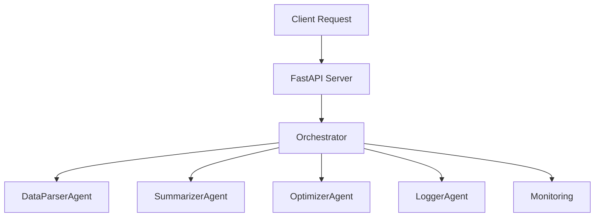

# Architecture

```mermaid
graph TD
    A[Client Request] --> B[FastAPI Server]
    B --> C[Orchestrator]
    C --> D[DataParserAgent]
    C --> E[SummarizerAgent]
    C --> F[OptimizerAgent]
    C --> G[LoggerAgent]
    C --> H[Monitoring]
```

This diagram illustrates the high level flow of a request through the MCP Agent Stack.
